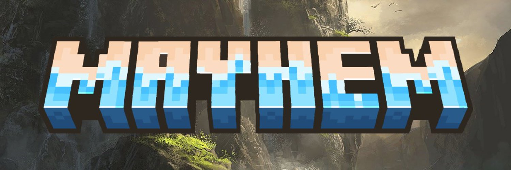

# こんにちは、みんな！

  
<h2>👀 Quick Overview</h2>

  
I'm Nazar, better known online as <b>SuperNeon4ik</b>. I'm 🇺🇦 Ukrainian! <i>(I live in Kyiv, so I am in a reasonably safe place, dw)</i> I'm a little silly, so don't mind. I am not much of an open-source developer, but whatever I can open-source, I will :3

  

    <picture>
      <source
        srcset="https://github-readme-stats.vercel.app/api?username=SuperNeon4ik&show_icons=true&theme=dark"
        media="(prefers-color-scheme: dark)"
      />
      <source
        srcset="https://github-readme-stats.vercel.app/api?username=SuperNeon4ik&show_icons=true"
        media="(prefers-color-scheme: light), (prefers-color-scheme: no-preference)"
      />
      
    </picture>
     
    <picture>
      <source
        srcset="https://github-readme-stats.vercel.app/api/top-langs/?username=SuperNeon4ik&size_weight=0.5&count_weight=0.5&theme=dark"
        media="(prefers-color-scheme: dark)"
      />
      <source
        srcset="https://github-readme-stats.vercel.app/api/top-langs/?username=SuperNeon4ik&size_weight=0.5&count_weight=0.5"
        media="(prefers-color-scheme: light), (prefers-color-scheme: no-preference)"
      />
      
    </picture>
  

  
<h2>❤️ Support Me!</h2>

  
I am Ukrainian. I live in Ukraine. Please first consider donating to <a href="https://savelife.in.ua/donate/">Come Back Alive</a>. If you wish to support me, I am very happy to recieve your donation over <a href="https://patreon.com/SuperNeon4ik">Patreon</a>! I am very greatful for every single cent you donate. I hope the war will end soon.

  
<h2>💪 My Skills</h2>

  
I am a self-taught programmer and I've been coding since I was like 9 years old. I praise back-end and hate on front-end, but forced to do both by calling. Currently, I am primarily a Java dev, but I do lots of different things.

  <h3>Web Technologies</h3>
  <ul>
    <li>JavaScript</li>
    <li>HTML, CSS</li>
    <li>Node.JS</li>
    <li>SvelteKit</li>
    <li>Express.JS</li>
    <li>FastAPI</li>
  </ul>

  <h3>Application & Game Development</h3>
  <ul>
    <li>C# (.NET)</li>
    <li>Unity (with C#)</li>
    <li>Python <i>(i am a hater)</i></li>
    <li>C++ <i>(was learning a little. made a gd hack with it, lol)</i></li>
  </ul>

  <h3>Databases</h3>
  
I didn't use any of these much.

  <ul>
    <li>Firebase Firestore</li>
    <li>Firebase Realtime Database</li>
    <li>MySQL</li>
  </ul>
  
  <h3>Modding</h3>
  <ul>
    <li>Minecraft Spigot/Paper Plugin Development</li>
    <li>Minecraft Forge/Fabric Mod Development <i>(sort of)</i></li>
    <li>Microsoft Dynamics 365 CRM <i>(didn't do anything fancy either)</i></li>
    <li>ADOFAI Modding <i>(working with it rn)</i></li>
  </ul>

  <h3>Other</h3>
  <ul>
    <li>GitHub Actions</li>
    <li>Chrome/Firefox Extension Development <i>(a little)</i></li>
    <li>Java <i>(duh)</i></li>    
  </ul>

  
<h2>🛠️ Projects</h2>

  <h3>Minecraft Mayhem</h3>
  
  
I am a plugin developer for a Minecraft Event called "Minecraft Mayhem". You should check it out one day. It's hosted once a month on Saturdays!

  <ul>
    <li><a href="https://discord.gg/mcmayhem">Discord Server</a></li>
    <li><a href="https://twitter.com/ItsMCMayhem">Twitter/X</a></li>
    <li><a href="https://www.twitch.tv/itsmcmayhem">Twitch</a></li>
    <li><a href="https://www.youtube.com/@itsmcmayhem">YouTube</a></li>
    <li><a href="https://tiktok.com/@itsmcmayhem">TikTok</a></li>
    <li><a href="https://mcmayhem.live/">Live Scoring Website</a></li>
  </ul>

  <h3>NoxesiumUtils</h3>
  
A paper plugin to communicate with the <a href="https://github.com/Noxcrew/noxesium">Noxesium mod</a>.

  <ul>
    <li><a href="https://modrinth.com/plugin/noxesiumutils">Modrinth</a></li>
    <li><a href="https://github.com/SuperNeon4ik/NoxesiumUtils">Source Code</a></li>
  </ul>

  
<h2>🔥 GitHub Streak</h2>

  

  
<h2>🤓 Languages</h2>

  
I am a big nerd and I like learning languages in my free time.

  <table>
    <tr>
      <th>Language</th>
      <th>Proficiency</th>
    </tr>
    <tr>
      <td>🇺🇦 Українська</td>
      <td>Native</td>
    </tr>
    <tr>
      <td>🏳️ Русский</td>
      <td>Native</td>
    </tr>
    <tr>
      <td>🇬🇧 English</td>
      <td>B2 <i>(or better, idk)</i></td>
    </tr>
    <tr>
      <td>🇩🇪 Deutsch</td>
      <td>A1</td>
    </tr>
    <tr>
      <td>🇯🇵 日本語</td>
      <td>Beginner</td>
    </tr>
    <tr>
      <td>🇱🇹 Lietuvių</td>
      <td>Beginner</td>
    </tr>
  </table>

  
<h2>🌐 Socials</h2>

  
I am everywhere, even in your walls.

  <ul>
    <li>
      
Twitter/X 🤓

      <ul>
        <li><a href="https://twitter.com/superneon4ik">Primary account<a></li>
        <li><a href="https://twitter.com/superneon4ik_ua">Ukrainian account 🇺🇦<a></li>
        <li><a href="https://twitter.com/superneon4ik_ua">Japanese account 🇯🇵<a></li>
      </ul>
    </li>
    <li><a href="https://social.kyiv.dcomm.net.ua/@neon">Mastodon</a></li>
    <li><a href="https://youtube.com/@SuperNeon4ik">YouTube</a></li>
    <li><a href="https://twitch.tv/SuperNeon4ik">Twitch</a></li>
    <li><a href="https://open.spotify.com/artist/28pRxb8uBLppv85gXDHyhV?si=21d9eff5909f4823">Spotify</a></li>
    <li>You should also visit <a href="https://superneon4ik.me">my personal website</a> :3</li>
  </ul>

